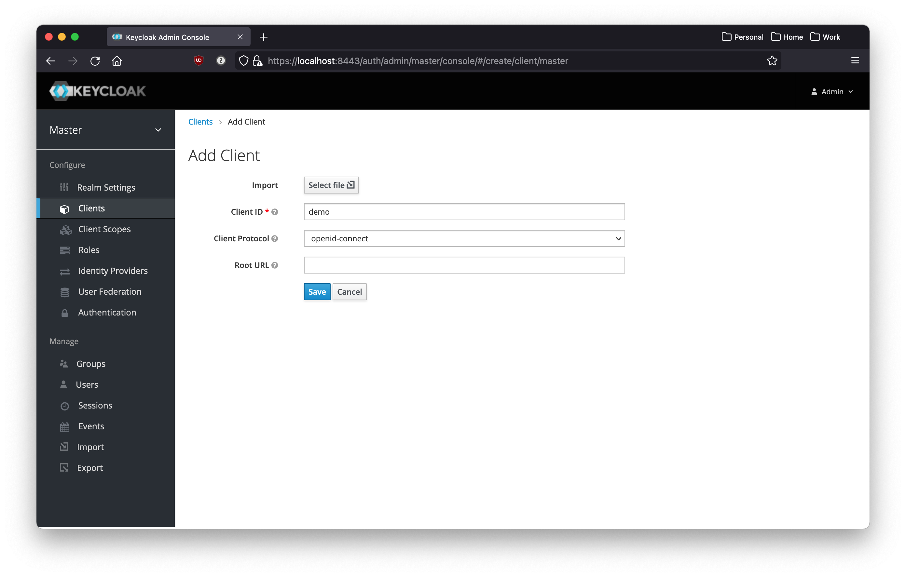
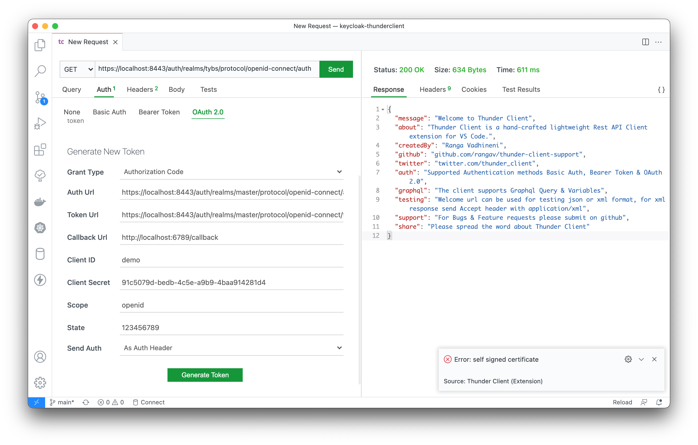

# Reproducing self signed certificate error

- Clone repo and start keycloak & postgres
```bash
docker-compose up
```

- Login to this page with `admin/123456`
https://localhost:8443/auth/admin/master/console

- Create a new client with demo.json


- Try to generate OAuth 2.0 Token
  - Request url does not matter as we are trying to get access token only
  - Get client secret from Keycloak > Clients > demo > Credentials tab

